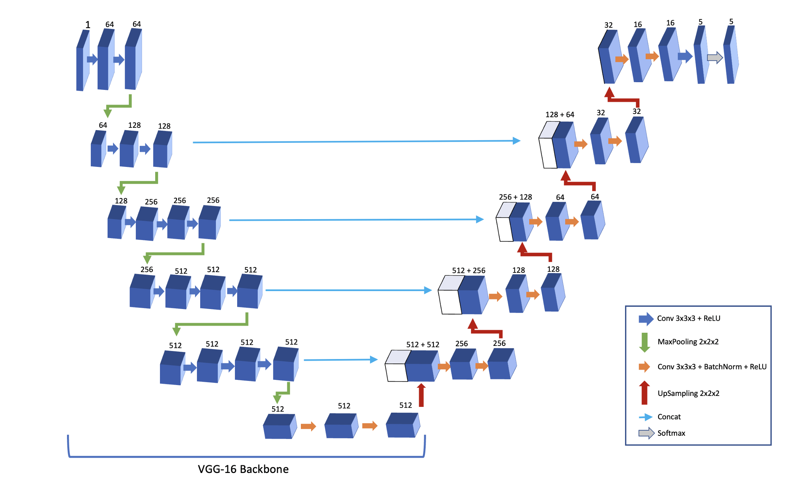

# Renal Vessel Segmentation pytorch
Code for the pytorch implementation of the 3D UNet-VGG16 backbone for the SAIAD project.

## Folder Structure
```bash
  .
  ├── README.md : read me file
  ├── dataset_test.ipynb : (ignore) ipynb for debugging some of the dataset functions
  ├── job.sge : job to submit to mesocenter
  ├── model_test.ipynb : (ignore) ipynb for debugging the model
  ├── runs : folder for Tensorboard runs
  ├── test.ipynb : ipynb with testing and inference pipelines
  ├── test_notebooks : (ignore) notebooks for debugging
  ├── train.py : train script
  ├── unet3d : main functions implementing UNet3D with VGG16 backbone
  ├── unet3dvgg16_tensorflow_summary.txt : (ignore) a model summary of the Tensorflow version of the model
  └── utils : other useful functions
```
## General Details
This repo implements the UNet3D model with a VGG16 backbone on Pytorch, as the one obtained by the Tensorflow based package `segmentation-models-3d`.


**Note**: although I tried to use all the same hyperparams between the TF and Pytorch models, some differences might still remain. Also, ADAM in Pytorch appears to be slightly different to TF, leading to worse results when training (see https://discuss.pytorch.org/t/suboptimal-convergence-when-compared-with-tensorflow-model/5099/49)

## Pre-Processing
The data in `SAIAD_data_cleared` is pre-processed in the notebook `process_all_data.ipynb`, into `SAIAD_data_processed` with the following steps:

 - Resample data to [0.5,0.5,1] voxel spacing.
 - Cut or pad x-y plane to 512x512
 - Cutting the intensity window to [-200,600]
 - Rescale to [0,255] values
 - Remove the slices that don't have vessel segmentations.
 - Pad (zero) in z-axis until nearest multiple of 64 (**note**: with the new random sampler, this isn't needed anymore, but doesn't hurt)
 - Convert the 2 labels assigned for kidneys into just 1, and remove the extra classes.
      - Renal cavities were converted to kidneys here
 - After this, the classes are:
0 - background; 1 - tumor; 2 - veins; 3 - arteries; 4 - kidneys

The folder structure of `SAIAD_data_processed` is:
```bash
SAIAD_data_processed
├── SAIAD 14
│   ├── scan.nrrd
│   └── segm.nrrd
├── SAIAD 15
│   ├── scan.nrrd
│   └── segm.nrrd
...
  
```

## Training
The general configuration for training 1 model is found in `unet3d/config.py`. The training itself is done by the script `unet3d/config.py`. I trained with validation/test patients 'SAIAD 1' and 'SAIAD 18 TER vasculaire', and got similar results to the Tensorflow implementation.

## Inference and Testing
The testing and inference is done in the notebook `test.ipynb`, using the `Tester` class from `unet3d/tester.py`. The inference pipeline is the following:

