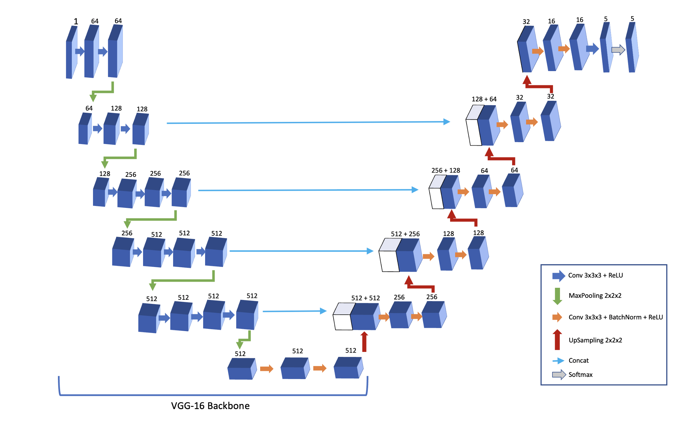
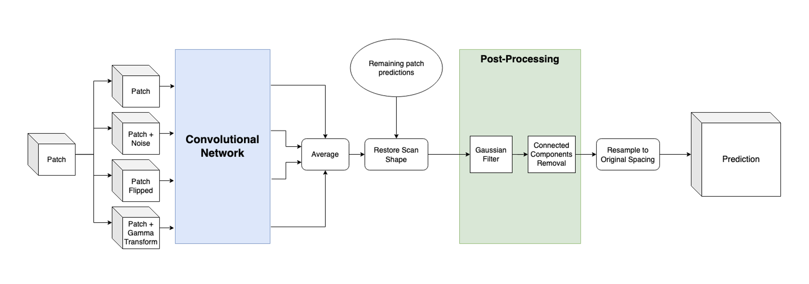

# Renal Vessel Segmentation PyTorch
PyTorch implementation of the 3D UNet-VGG16 backbone for the SAIAD project.

## Folder Structure
```bash
  .
  ├── unet3d/ : main functions implementing UNet3D with VGG16 backbone
  ├── utils/ : other useful functions and files
  ├── runs/ : folder for Tensorboard runs
  ├── test_notebooks/ : (ignore) more notebooks for debugging
  ├── train.py : train script
  ├── test.ipynb : ipynb with testing and inference pipelines
  ├── process_all_data.ipynb : notebook used for pre-processing all the scans
  ├── requirements.txt : minimum package requirements
  ├── model_test.ipynb : (ignore) ipynb for debugging the model
  ├── dataset_test.ipynb : (ignore) ipynb for debugging some of the dataset functions
  └── README.md
```
## General Details
This repo implements the UNet3D model with a VGG16 backbone on Pytorch, as the one obtained by the Tensorflow based package `segmentation-models-3d`. It was trained on 96x96x96 size patches.


**Note**: although I tried to use all the same hyperparams between the TF and Pytorch models, some differences might still remain. Also, ADAM in Pytorch appears to be slightly different to TF, leading to worse results when training (see https://discuss.pytorch.org/t/suboptimal-convergence-when-compared-with-tensorflow-model/5099/49)

## Pre-Processing
The data in `SAIAD_data_cleared` is pre-processed in the notebook `process_all_data.ipynb`, into `SAIAD_data_processed` with the following steps:

 - Resample data to [0.5,0.5,1] voxel spacing.
 - Cut or pad x-y plane to 512x512
 - Cutting the intensity window to [-200,600]
 - Rescale to [0,255] values
 - Remove the slices that don't have vessel segmentations from the top and bottom of the scan
 - Pad (zero) in z-axis until nearest multiple of 64 (**note**: with the new random sampler, this isn't needed anymore, but doesn't hurt)
 - Convert the 2 labels assigned for kidneys into just 1, and remove the extra classes.
      - Renal cavities were converted to kidneys here
 - After this, the classes are:
0 - background; 1 - tumor; 2 - veins; 3 - arteries; 4 - kidneys

The folder structure of `SAIAD_data_processed` is:
```bash
SAIAD_data_processed
├── SAIAD 14
│   ├── scan.nrrd
│   └── segm.nrrd
├── SAIAD 15
│   ├── scan.nrrd
│   └── segm.nrrd
...
  
```

## Training
The general configuration for training 1 model is found in `unet3d/config.py`, and the data augmentations used are in `unet3d/transforms.py`. The training itself is done by the script `train.py`. I trained with validation/test patients 'SAIAD 1' and 'SAIAD 18 TER vasculaire', and got similar results to the Tensorflow implementation.

### Requirements
The training was done on a Tesla T100 16GB, and took about 4h per model. It uses about 13GB of VRAM and 20-30GB of RAM.


## Inference and Testing
The testing and inference is done in the notebook `test.ipynb`, using the `Tester` class from `unet3d/tester.py`. This class can be used either for testing (known truth), or just inference (no known truth segmentation). The inference pipeline is the following:


### How the model generates predictions
Sequentially, the following happens:
1. `Tester` loads the provided model and creates the folders (paths in `config.py`) where the predictions with uniform voxel spacing and original voxel spacing will be sent to.
2. It reads the test patient scans, and pads the axes to the nearest multiple of `step_size`.
    * Here, it saves the original voxel spacing of that patient (to resample at the end), and the paddings on each side, so the metadata in the final `nrrd` file doesn't get screwed up.
3. It patchifies the test scan, and then predicts on each patch (or multiple transforms of each patch, depending on the `with_transforms` value.
4. It unpatchifies the predicted patches, taking into account the overlapping zones.
5. The padded scan and predicted segmentation are unpadded (with the values saved before).
6. Now, `save_uniform_spacing_segm()` saves the predicted segmentation, the truth segmentation[^1] and the scan to the `PREDICTIONS_UNIF_PATH`.
7. `resample_to_original_and_save()` resamples the scan to the correct/original voxel spacing, and it saves the predicted segmentation, the truth segmentation[^1] and the scan to the `PREDICTIONS_ORIGIN_PATH`. 

By the end, we have the scan and the predicted segmentation in `PREDICTIONS_ORIGIN_PATH/SAIAD_test_patient`.
[^1]: The scan is saved along with the predicted segmentation and the *true* segmentation for a more accurate Dice calculation, since resampling from original voxel spacing -> uniform -> original might change the true segmentation and scan slightly.


## How to use
- Change the dataset paths in `config.py` to the ones we are using (see Pre-processing section for folder layout).
- Assuming you don't have pre-processed data, we need to run `process_all_data.ipynb` to process the data. Run all the cells in it, a new folder at DATASET_PATH (set in config) will now have the pre-processed data.

We are now ready to train (and then test) our models. Change the training parameters in `config.py`to your heart's content and run `train.py`.
